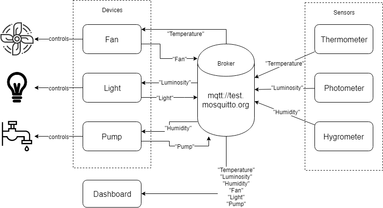

# Smart Farm

## Overview

Build a simple version of a *Pleurotus ostreatus* smart farm

## Proposed Solution

### Conditions

We identify the following conditions that will be applied to our mushroom farm. Please refer to [1] for more details.

|             | min value | max value |
| ----------- | --------- | --------- |
| Temperature | 10 &deg;C | 17 &deg;C |
| Luminosity  | 800 lux   | 1500 lux  |
| Humidity    | 85%       | 95%       |


### Modules




## Demo run

```
npm install
node sensor_hygrometer.js
node sensor_photometer.js
node sensor_thermometer.js
node actuator_fan.js
node actuator_light.js
node actuator_pump.js
node dashboard.js
```


## References

[1] [*Pleurotus ostreatus*](https://www.mycelia.be/en/strain-list/m-2191-pleurotus-ostreatus)